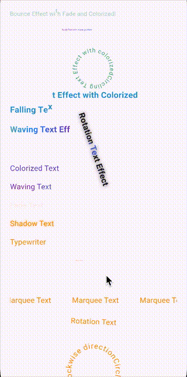

# my_animated_text
[](https://pub.dev/packages/my_animated_text) &nbsp;
[](https://github.com/tz-thantzin/my_animated_text/stargazers) &nbsp;
[](https://github.com/tz-thantzin/my_animated_text/blob/main/LICENSE) &nbsp;
[](https://buymeacoffee.com/devthantziq)



✨ A Flutter package offering a collection of customizable animated text widgets to enhance your app's UI with engaging text animations.

---

## 📦 Features

* **SlideText**: Slides text in from left to right or right to left.
* **TypewriterText**: Simulates a typewriter effect, revealing text character by character.
* **WaveMotionText**: Applies a sinusoidal wave motion to each character.
* **WavingGradientText**: Applies a waving gradient effect to the text.
* **ShimmerText**: Creates a shimmer shine effect.
* **FadeText**: Fades text in/out.
* **ScaleText**: Scales text up and down.
* **RotationText**: Rotates text back and forth.
* **MarqueeText**: Moves text horizontally like a marquee.
* **FallingText**: Makes each character fall into place.
* **ColorizedText**: Animates text through multiple colors.
* **BouncingText**: Animates each character with a bouncing effect.
* **ShadowText**: Animates text shadows.
* **BlurText**: Brings text into focus with an animated blur.
* **FlipText**: Adds a 3D-style flip reveal on the X or Y axis.
* **ShakeText**: Adds a damped shake for alerts and attention states.
* **CirclingText**: Animates text in a circular path.
* **MultiAnimatedText**: Combine multiple effects for a single text widget (e.g., Falling + Colorized).
* **AnimateText / String.animate()**: Chain effects with a fluent API and predictable timing windows.

---
### Attribute

| Property       | Type                     | Default                                | Description |
|----------------|--------------------------|----------------------------------------|-------------|
| `text`         | `String`                 | —                                      | The text content to animate |
| `duration`     | `Duration`               | `Duration(milliseconds: 2000)`        | Duration of the animation. Ignored if an external controller is provided |
| `style`        | `TextStyle?`             | `null`                                 | Optional text style |
| `mode`         | `AnimatedTextMode`       | `AnimatedTextMode.forward`            | Defines how the animation plays (forward, reverse, loop, etc.) |
| `autoStart`    | `bool`                   | `true`                                 | Automatically start animation on widget initialization |
| `controller`   | `AnimationController?`   | `null`                                 | Optional external AnimationController; if null, one is created internally |
| `onStarted`    | `VoidCallback?`          | `null`                                 | Callback triggered when the animation starts |
| `onCompleted`  | `VoidCallback?`          | `null`                                 | Callback triggered when the animation completes |
| `onRepeated`   | `VoidCallback?`          | `null`                                 | Callback triggered when the animation repeats (loop/reverse) |
---
## 📥 Installation

Add the following dependency to your `pubspec.yaml`:

```yaml
dependencies:
  my_animated_text: ^{version}
```

or run below in your terminal
 
```bash
 $ flutter pub add my_animated_text
```

Then, run:

```bash
 $ flutter pub get
```

---

## 🧪 Usage

Import the package:

```dart
import 'package:my_animated_text/my_animated_text.dart';
```

### Fluent multi-effect composition

```dart
'Launch faster'.animate(
  style: TextStyle(fontSize: 24, fontWeight: FontWeight.bold),
  duration: Duration(milliseconds: 2600),
)
    .blur(duration: Duration(milliseconds: 500), advanceCursor: false)
    .flip(duration: Duration(milliseconds: 700), advanceCursor: false)
    .shimmer(delay: Duration(milliseconds: 200), advanceCursor: false)
    .then(delay: Duration(milliseconds: 120))
    .shake(duration: Duration(milliseconds: 450));
```

### SlideText

```dart
SlideText(
  'Hello, World!',
  direction: SlideDirection.leftToRight,
  style: TextStyle(fontSize: 24, fontWeight: FontWeight.bold),
)
```

### TypewriterText

```dart
TypewriterText(
  'Hello, World!',
  duration: Duration(seconds: 5),
  style: TextStyle(fontSize: 24, fontWeight: FontWeight.bold),
)
```

### WaveMotionText

```dart
WaveMotionText(
  'Hello, World!',
  style: TextStyle(fontSize: 24, fontWeight: FontWeight.bold),
)
```

### WavingGradientText

```dart
WavingGradientText(
  'Hello, World!',
  colors: [Colors.red, Colors.blue, Colors.green],
  direction: WavingDirection.leftToRight,
  style: TextStyle(fontSize: 24, fontWeight: FontWeight.bold),
)
```

### ShimmerText

```dart
ShimmerText(
  'Shimmering Text',
  style: TextStyle(fontSize: 24, fontWeight: FontWeight.bold),
)
```

### FadeText

```dart
FadeText(
  'Fading Text',
  style: TextStyle(fontSize: 24, fontWeight: FontWeight.bold),
)
```

### ScaleText

```dart
ScaleText(
  'Scaling Text',
  style: TextStyle(fontSize: 24, fontWeight: FontWeight.bold),
)
```

### RotationText

```dart
RotationText(
  'Rotating Text',
  style: TextStyle(fontSize: 24, fontWeight: FontWeight.bold),
  rotationDirection: RotationDirection.custom,
  rotationDegrees: 180, 
)
```

```dart
CirclingText(
    'Circling Text Circling Text ',
    style: TextStyle(fontSize: 24, fontWeight: FontWeight.bold),
    mode: AnimatedTextMode.loop,
    direction: CirclingDirection.clockwise,
    radius: 45,
),
```

### MarqueeText

```dart
MarqueeText(
  'Scrolling Text',
  speed: 50,
  style: TextStyle(fontSize: 24, fontWeight: FontWeight.bold),
)
```

### FallingText

```dart
FallingText(
  'Falling Text',
  style: TextStyle(fontSize: 24, fontWeight: FontWeight.bold),
)
```

### ColorizedText

```dart
ColorizedText(
  'Colorful Text',
  colors: [Colors.red, Colors.yellow, Colors.blue],
  style: TextStyle(fontSize: 24, fontWeight: FontWeight.bold),
)
```

### BouncingText

```dart
BouncingText(
  'Bouncing Text',
  style: TextStyle(fontSize: 24, fontWeight: FontWeight.bold),
)
```

### ShadowText

```dart
ShadowText(
  'Shadow Text',
  style: TextStyle(fontSize: 24, fontWeight: FontWeight.bold),
  mode: AnimatedTextMode.reverseLoop,
)
```

### MultiAnimatedText

```dart
MultiAnimatedText(
  'Falling & Colorized!',
  style: TextStyle(fontSize: 24, fontWeight: FontWeight.bold),
  effects: [
    FallingEffect(begin: 0.0, end: 0.45),
    ColorizeEffect(
      colors: [Colors.red, Colors.yellow, Colors.blue],
      begin: 0.2,
      end: 1.0,
    ),
  ],
  mode: AnimatedTextMode.loop,
)
```

```dart
BouncingText(
  'Bounce Effect with Fade and Colorized!',
).withEffects([
  const FadeEffect(begin: 0.0, end: 0.35),
  ColorizeEffect(begin: 0.0, end: 1.0),
]);
```

### Fluent composition

```dart
'Hello Flutter'.animate(
  style: const TextStyle(fontSize: 28, fontWeight: FontWeight.bold),
  duration: const Duration(seconds: 3),
)
.fade(duration: const Duration(milliseconds: 400))
.scale(duration: const Duration(milliseconds: 500))
.then(delay: const Duration(milliseconds: 150))
.slide(direction: SlideDirection.bottomToTop)
.shimmer(advanceCursor: false);
```

Use `advanceCursor: false` when you want effects to overlap on the same portion of the timeline. You can also convert any existing `MultiAnimatedText` into the fluent API with `.compose()`.

---

## 📄 Example Project

For a complete example demonstrating all animated text widgets, check out the [example](example/) directory in this repository.

---

## 🔧 Development

To contribute or run the example locally:

1. Clone the repository:

```bash
git clone https://github.com/tz-thantzin/my_animated_text.git
cd my_animated_text
```

2. Install dependencies:

```bash
flutter pub get
```

3. Run the example:

```bash
flutter run
```

---

## 📝 License

This project is licensed under the MIT License - see the [LICENSE](LICENSE) file for details.

---

## 📣 Acknowledgments

* Inspired by various Flutter animation libraries.
* Special thanks to the Flutter community for their continuous support.

---

## 🌐 Links

* GitHub Home: [https://github.com/tz-thantzin](https://github.com/tz-thantzin)
* Repository: [https://github.com/tz-thantzin/my\_animated\_text](https://github.com/tz-thantzin/my_animated_text)

Copyright (©️) 2025 __Thant Zin__