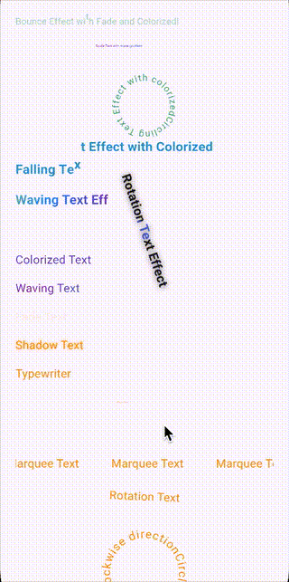

# my\_animated\_text Example Project

This example project demonstrates all the animated text widgets from the **my\_animated\_text** Flutter package.



---

## 📦 Features

This example showcases all text animations included in the package:

* **SlideText**: Slides text from left or right.
* **TypewriterText**: Reveals text character by character.
* **WaveMotionText**: Creates wave motion for each character.
* **WavingGradientText**: Gradient text with waving animation.
* **ShimmerText**: Shimmer/shine effects on text.
* **FadeText**: Fading in and out.
* **ScaleText**: Scaling up and down.
* **RotationText**: Rotates back and forth.
* **MarqueeText**: Scrolling text horizontally.
* **FallingText**: Characters falling into place.
* **ColorizedText**: Cycling through multiple colors.

---

## 🔧 Getting Started

1. Clone this repository:

```bash
git clone https://github.com/tz-thantzin/my_animated_text.git
cd my_animated_text/example
```

2. Install dependencies:

```bash
flutter pub get
```

3. Run the example:

```bash
flutter run
```

---

## 🧪 Example Usage

### SlideText

```dart
SlideText('Hello Slide!', style: TextStyle(fontSize: 24));
```

### TypewriterText

```dart
TypewriterText('Typing...', style: TextStyle(fontSize: 24));
```

### WaveMotionText

```dart
WaveMotionText('Wave Motion', style: TextStyle(fontSize: 24));
```

### WavingGradientText

```dart
WavingGradientText('Gradient Wave', style: TextStyle(fontSize: 24));
```

### ShimmerText

```dart
ShimmerText('Shimmer', style: TextStyle(fontSize: 24));
```

### FadeText

```dart
FadeText('Fade In', style: TextStyle(fontSize: 24));
```

### ScaleText

```dart
ScaleText('Scale', style: TextStyle(fontSize: 24));
```

### RotationText

```dart
RotationText('Rotate', style: TextStyle(fontSize: 24));
```

### MarqueeText

```dart
MarqueeText('Scrolling Marquee', style: TextStyle(fontSize: 24));
```

### FallingText

```dart
FallingText('Falling', style: TextStyle(fontSize: 24));
```

### ColorizedText

```dart
ColorizedText('Colorful!', style: TextStyle(fontSize: 24));
```

---

## 🌐 Links

* GitHub Home: [https://github.com/tz-thantzin](https://github.com/tz-thantzin)
* Repository: [https://github.com/tz-thantzin/my\_animated\_text](https://github.com/tz-thantzin/my_animated_text)

---

## License

MIT License. See the LICENSE file for details.
